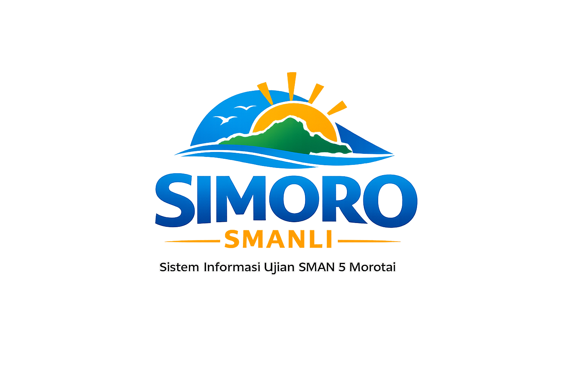

<p align="center"></p>
# 🏫 Web Skola SMA5

## 🔒 Perlindungan & Hak Cipta
Project ini dilindungi dengan lisensi MIT. Pengguna bebas memodifikasi dan mendistribusikan, namun wajib mencantumkan kredit ke pembuat asli. Tidak diperbolehkan asal copy-paste tanpa menghormati lisensi dan hak cipta.

## ✨ Penjelasan Fitur
Platform ini menyediakan:
- Manajemen ujian dan soal
- Monitoring sesi ujian secara real-time
- Rekap hasil ujian otomatis
- Manajemen kelas, siswa, dan guru
- Logging aktivitas ujian
- Dashboard admin interaktif
- Autentikasi dan otorisasi user

Setiap fitur dirancang untuk mendukung administrasi dan monitoring ujian di SMA secara efisien dan aman.

<p align="center">
<a href="https://github.com/riskikautjil104/simoro-smanli/actions"></a>
<a href="https://packagist.org/packages/laravel/framework"></a>
<a href="https://packagist.org/packages/laravel/framework"></a>
<a href="https://packagist.org/packages/laravel/framework"></a>
</p>

# 🏫 Web Skola SMA5

**Sistem Monitoring dan Ujian Online SMA Negeri 5**

> Platform modern berbasis Laravel untuk manajemen ujian, monitoring siswa, dan administrasi sekolah.

---

## 🚀 Fitur Utama
- Manajemen ujian dan soal
- Monitoring sesi ujian secara real-time
- Rekap hasil ujian otomatis
- Manajemen kelas, siswa, dan guru
- Logging aktivitas ujian
- Dashboard admin interaktif
- Autentikasi dan otorisasi user

## 🛠️ Teknologi
- Laravel (PHP)
- Tailwind CSS
- Vite
- MySQL/MariaDB
- Pest (Testing)

## 📁 Struktur Project
- `app/Http/Controllers/` — Controller aplikasi
- `app/Models/` — Model database (Exam, ExamLog, ExamResult, ExamSession, Question, SchoolClass, StudentAnswer, Subject, User)
- `resources/views/` — Blade view
- `routes/` — Routing aplikasi
- `database/migrations/` — Migrasi database
- `database/seeders/` — Seeder data awal

## ⚡ Instalasi & Setup
1. Clone repo:
	```bash
	git clone https://github.com/riskikautjil104/simoro-smanli.git
	```
2. Install dependencies:
	```bash
	composer install && npm install && npm run build
	```
3. Copy `.env.example` ke `.env` dan konfigurasi database
4. Generate key:
	```bash
	php artisan key:generate
	```
5. Migrasi dan seeder:
	```bash
	php artisan migrate --seed
	```
6. Jalankan server:
	```bash
	php artisan serve
	```

## 👤 Kontribusi
Kontribusi sangat terbuka! Silakan fork, buat branch, dan pull request. Lihat [CONTRIBUTING.md](https://laravel.com/docs/contributions) untuk panduan.

## 🛡️ Keamanan
Laporkan kerentanan ke [taylor@laravel.com](mailto:taylor@laravel.com).

## 📄 Lisensi
MIT License.

---

<p align="center">Made with ❤️ for SMA Negeri 5</p>
